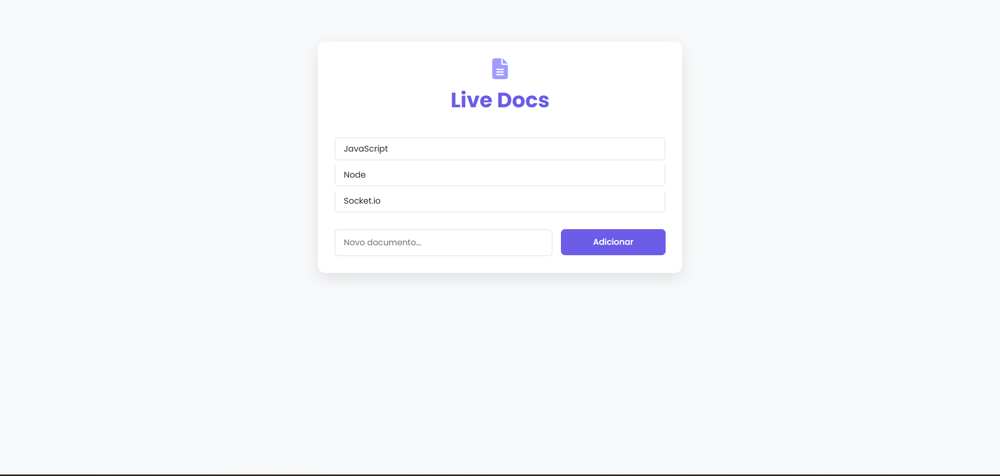
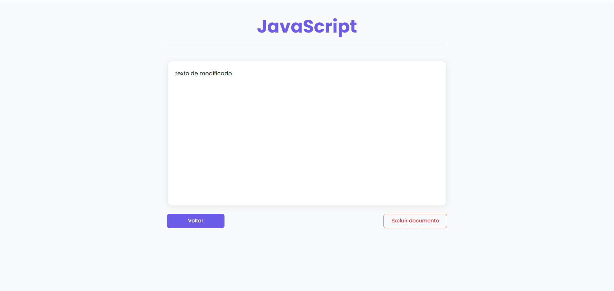

# Live Docs

Live Docs is a collaborative real-time document editing application built with Node.js, Express, and Socket.io. It allows multiple users to edit documents simultaneously, with changes instantly synchronized across all connected clients.

<p align="center">
  
  <br>
  
</p>

## Features

- **Real-time Collaboration:** Multiple users can edit the same document at the same time, with live updates.
- **Document Management:** Create, view, and delete documents from a simple web interface.
- **Socket.io Integration:** Efficient WebSocket communication for low-latency updates.
- **Modern UI:** Responsive interface built with Bootstrap.

## Project Structure

```
alura-docs/
├── public/
│   ├── documento.html
│   ├── documento.js
│   ├── index.html
│   └── socket-front-document.js
├── src/
│   ├── servidor.js
│   └── socket-back.js
├── assets/
│   ├── document.png
│   └── index.png
├── package.json
└── README.md
```

- **public/**: Frontend files (HTML, JS) served to the browser.
- **src/**: Backend server and WebSocket logic.

## Getting Started

### Prerequisites

- [Node.js](https://nodejs.org/) (v14 or higher recommended)
- npm (comes with Node.js)

### Installation

1. Clone the repository:

   ```sh
   git clone https://github.com/jpvgoes/WebSocket_Node.js.git
   cd alura-docs
   ```

2. Install dependencies:
   ```sh
   npm install
   ```

### Running the Application

Start the development server with:

```sh
npm run dev
```

The server will start on [http://localhost:3000](http://localhost:3000).

### Usage

1. Open [http://localhost:3000](http://localhost:3000) in your browser.
2. Select an existing document or create a new one.
3. Share the document link with others to collaborate in real time.

## Technologies Used

- [Node.js](https://nodejs.org/)
- [Express](https://expressjs.com/)
- [Socket.io](https://socket.io/)
- [Bootstrap](https://getbootstrap.com/)

## License

This project is licensed under the ISC License.

## Author

- [@jpvgoes](https://github.com/jpvgoes)

---

> This project is part of the Alura Docs
